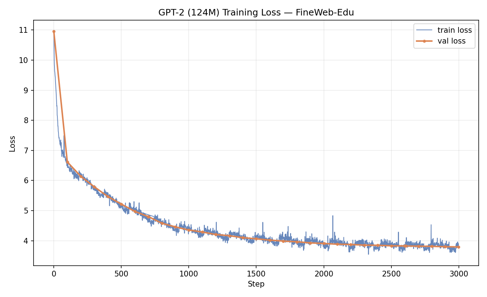

# Building GPT-2 (124M) From Scratch

A from-scratch PyTorch reimplementation and pretraining of GPT-2 (124M), trained on FineWeb-Edu and evaluated on HellaSwag — including a correctness test that loads real OpenAI GPT-2 weights and verifies this implementation produces matching logits.

This project follows the architecture and training recipe from Andrej Karpathy's ["Let's reproduce GPT-2"](https://github.com/karpathy/build-nanogpt) series. The model, data pipeline, and eval harness are built from that lineage; the additions below — the Colab/T4-specific training adaptations, the correctness test suite, and the trained checkpoint — are my own work on top of it.

## Repo structure

```
GPT-2.ipynb       # full annotated walkthrough: architecture explained cell-by-cell,
                   # the general/portable training loop (source for GPT2_Train.py),
                   # AND the actual Colab T4 execution that produced log.txt/the checkpoint
                   # (Drive mount, shard verify/repair, the real training run, resume/extension)
GPT2.py            # model architecture (GPTConfig, CausalSelfAttention, MLP, Block, GPT)
GPT2_Train.py      # training loop: data loading, LR schedule, grad accumulation,
                   # periodic val loss + HellaSwag eval, checkpointing
GPT2_Test.py       # correctness tests -- run these before trusting anything else here
fineweb.py         # downloads + tokenizes FineWeb-Edu into shards (produces the data
                   # GPT2_Train.py reads from)
hellaswag.py       # downloads HellaSwag, renders examples, scores completions
log/
  log.txt          # step-by-step train/val loss from the actual run
  model_02999.pt   # trained checkpoint (see "Weights" below -- not stored directly in git)
```

**Run order if starting from scratch:** `fineweb.py` → `GPT2_Test.py` → `GPT2_Train.py` → `hellaswag.py` (final eval on the finished checkpoint). `GPT-2.ipynb` covers the same ground with full explanation, and is also where the actual training run in this repo (Colab T4, the one behind `log.txt` and the checkpoint) was executed — `GPT2_Train.py` is that same logic extracted into a clean, portable script.

## What's original here

The reference recipe assumes a multi-A100 setup. Getting an equivalent run working on a single free Colab T4 required real changes, not just a smaller batch size:

- **fp16 instead of bf16.** The T4 (Turing, sm75) has no TF32 or bf16 tensor cores — both are Ampere+ features. Its fast path is fp16 tensor cores, so training uses `torch.autocast(dtype=torch.float16)` with `GradScaler` to guard against fp16's narrower exponent range underflowing small gradients.
- **Checkpoint/resume across disconnected sessions.** Free Colab sessions cap out around 10–12 hours and can drop earlier. Training writes checkpoints to Google Drive and auto-resumes from the last one on restart, so a disconnect costs at most ~45 minutes of progress rather than the whole run.
- **Shard integrity verification and repair.** A Drive upload of a tokenized data shard was silently truncated (a clean multiple of MiB — the signature of an interrupted upload). Diagnosed by comparing expected `.npy` size against actual file size, then repaired by rewriting a self-consistent `.npy` from the valid token prefix rather than re-tokenizing from scratch.
- **A correctness test suite (`GPT2_Test.py`)** that loads real GPT-2 weights from HuggingFace into this implementation and checks the output logits match, within float tolerance — independent proof this is GPT-2, not just "a transformer that trains and doesn't crash."
- **A training schedule scaled to what's actually achievable.** The reference recipe targets ~19,073 steps (~10B tokens, one epoch of FineWeb-Edu). `GPT2_Train.py` is written to support that, but `max_steps` is set to 11,444 — a reduced target sized for what's realistic across a handful of free-tier Colab T4 sessions rather than the multi-GPU setup the original recipe assumes.

## Architecture

Standard GPT-2 decoder-only transformer:

- Token + learned positional embeddings
- 12 transformer blocks, each: LayerNorm → causal multi-head self-attention → residual add → LayerNorm → MLP (4x expansion, GELU) → residual add
- 12 attention heads, 768-dim embeddings, 1024 context window, 50,257-token GPT-2 BPE vocab (padded to 50,304 during training for tensor-core-friendly shapes)
- Weight tying between the token embedding and output projection
- ~124M parameters

| Hyperparameter | Value |
|---|---|
| n_layer | 12 |
| n_head | 12 |
| n_embd | 768 |
| block_size | 1024 |
| vocab_size | 50,257 (50,304 padded for training) |
| batch size (tokens/step) | 524,288 (2^19) |
| micro-batch (B, T) | 4, 1024 |
| optimizer | AdamW (β1=0.9, β2=0.95, eps=1e-8), fused where available |
| grad clipping | global norm ≤ 1.0 |
| LR schedule | linear warmup (715 steps) → cosine decay to 0.1 × max_lr |

## Training data

[FineWeb-Edu](https://huggingface.co/datasets/HuggingFaceFW/fineweb-edu) (`sample-10BT`), tokenized with the GPT-2 BPE tokenizer via `tiktoken` and packed into 100M-token `.npy` shards (`fineweb.py`).

## Evaluation

Two independent checks, testing different things:

- **`GPT2_Test.py`** — architecture correctness. Loads real OpenAI GPT-2 weights into this implementation and confirms logits match HuggingFace's `GPT2LMHeadModel`, plus a single-batch overfit sanity check. Proves the code is *right*, independent of any training run.
- **[HellaSwag](https://github.com/rowanz/hellaswag)** (`hellaswag.py`) — validation set (10,042 examples), evaluated completion-style: each candidate ending is scored by average per-token loss, lowest-loss ending is the prediction. Proves the *trained model* is making informed predictions, not guessing.

## Results

**Scope note:** this repo contains one completed training run — 2,999 steps (~1.5B tokens), a fraction of even the reduced 11,444-step target `GPT2_Train.py` is configured for (itself already scaled down from the reference recipe's ~19,073 steps). The training code supports running further, but doing so wasn't feasible within the free-tier Colab T4 compute available for this project. The numbers below reflect that partial run and demonstrate the pipeline works end-to-end, not a fully converged model.

Training progress is logged step-by-step in [`log/log.txt`](log/log.txt): val loss drops from 10.95 at step 0 to 3.79 at the final logged step.

| Model | Steps | Final train loss | Final val loss |
|---|---|---|---|
| This run | 2,999 | 3.824 | 3.795 |

Loss curve (train loss per step, val loss every 100 steps) plotted from `log.txt`:



_(Generate this with a short matplotlib script reading `log/log.txt` — worth including since it's the single most persuasive image in the README: it's the visual proof the run actually worked.)_

Sample generations:

```
Generate this with a short matplotlib script reading `log/log.txt` — worth including since it's the single most persuasive image in the README: it's the visual proof the run actually worked.

```

## Weights

The final trained checkpoint (`model_02999.pt`, ~533MB) is **not stored directly in this git repo** — GitHub rejects regular pushes over 100MB, and even under that limit a repo full of binary checkpoints is bad practice (bloats every clone forever, since git never forgets old blob versions). Pick one:

- **HuggingFace Hub (recommended)** — upload with `huggingface-cli upload <your-username>/gpt2-124m-fineweb model_02999.pt`, then link it here. This is the standard place for model weights specifically: it's built for large binary files, versions them properly, and lets anyone load your checkpoint with a one-line `hf_hub_download` instead of cloning the whole repo just to get a `.pt` file.
- **Git LFS** — if you want the weights to live alongside the code in the same repo, `git lfs track "*.pt"` before committing. Keeps everything in one place, but LFS bandwidth/storage has its own (small) free-tier limits on GitHub, worth checking before relying on it long-term.
- **GitHub Releases** — attach the `.pt` file as a release asset (up to 2GB) instead of committing it to the repo history. Simple, no extra tooling, but less discoverable than the Hub for anyone specifically looking for GPT-2 checkpoints.

Once uploaded, load it with:

```python
checkpoint = torch.load("model_02999.pt", map_location=device, weights_only=False)
model = GPT(checkpoint['config'])
model.load_state_dict(checkpoint['model'])
```

## Running it

1. `python fineweb.py` — downloads and tokenizes FineWeb-Edu into `edu_fineweb10B/`
2. `pytest GPT2_Test.py -v` — confirm the architecture matches real GPT-2 before spending compute training it
3. `python GPT2_Train.py` — trains from scratch, logging to `log/log.txt` and checkpointing to `log/`
4. `python hellaswag.py` — evaluate a trained checkpoint (or a HuggingFace reference model) on HellaSwag directly

## Acknowledgments

Architecture and training recipe based on Andrej Karpathy's [build-nanogpt](https://github.com/karpathy/build-nanogpt) and the accompanying ["Let's reproduce GPT-2" video](https://www.youtube.com/watch?v=l8pRSuU81PU). Hyperparameter choices follow the GPT-2 and GPT-3 papers (OpenAI never published GPT-2's exact training hyperparameters, so GPT-3's paper fills the gaps where it documents them).
